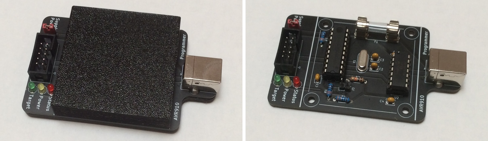

# AVR910 Programmer

This repository contains all files required to build a programmer based on the application note [AVR910](http://ww1.microchip.com/downloads/en/appnotes/atmel-0943-in-system-programming_applicationnote_avr910.pdf) by Atmel.

**WARNING**: This programmer is totally outdated and you should not build it if you need a useable programmer!

You can use this programmer to burn *.ebn* files using *AvrProg*. This is the only valid use case I know of.\
Alternatively, you could search for the illusive *EBN2HEX.exe* to convert the *.ebn* file.

If you're still interested you can start by looking at my board design [here](./pcb).
